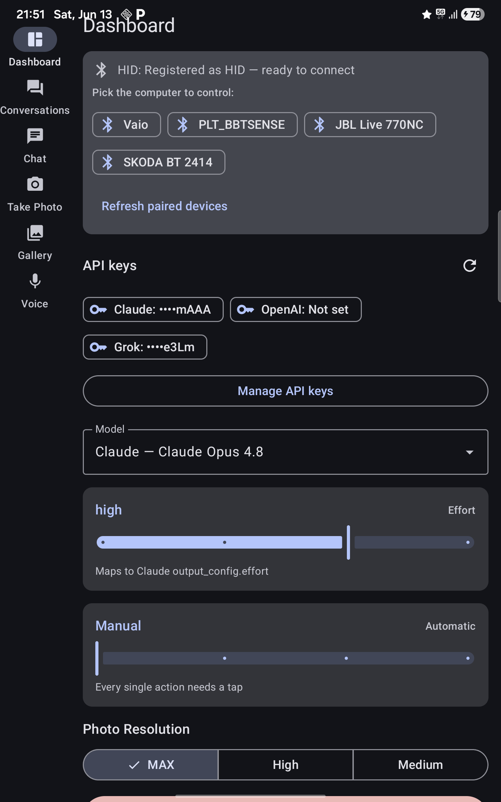

# Pocket Technician

**A computer support expert in your phone.**

Pocket Technician turns an Android phone into an AI-powered computer support technician. The user points the phone camera at the computer screen, pairs the phone as a Bluetooth keyboard and mouse, and explains the problem through chat. The AI can then observe the screen, operate the computer, provide temporary internet if needed, and verify that the issue has been resolved — **without installing any support software on the computer**.

> AI support that can see the problem, operate the computer, and verify that the issue has been resolved.

> 🔒 **Intended use:** only on computers you own or are explicitly authorized to operate, under your supervision. Because the app sends real keyboard and mouse input to another machine, using it without consent may be illegal. Please read the [DISCLAIMER](DISCLAIMER.md) before use.

## How it works

1. Open the Pocket Technician app on an Android phone.
2. Place the phone in a stand facing the computer screen.
3. **Start the HID server in the app *before* connecting over Bluetooth.** The phone must be advertising as an HID device first; only then pair it with the computer as a Bluetooth keyboard and mouse (HID — Human Interface Device).
4. Describe the problem through chat or voice.
5. Let the AI technician observe and control the computer under your supervision.

> ⚙️ **Pairing order matters.** Always **start the HID server first, then make the Bluetooth connection.** If the computer connects before the phone is advertising as an HID device, it will pair as a plain phone and keyboard/mouse control will not work.
>
> 🛠️ **If the HID connection can't be established:** remove the pairing from Bluetooth memory on **both** the phone **and** the computer (delete/forget the device on each side), then start over — start the HID server in the app first, and only then pair again. This clears stale Bluetooth/SDP records that block the HID profile from being offered.

The phone acts as the technician's:

| Role | Mechanism |
|------|-----------|
| **Eyes** | The camera observes the computer screen |
| **Hands** | Bluetooth keyboard and mouse (HID) control |
| **Brain** | A multimodal AI model interprets the screen, plans actions, and checks results |
| **Connection** | The phone's own Wi-Fi or mobile data for AI access |
| **Emergency internet** | USB tethering can share the phone's internet with the computer |

## Why it's different

Traditional remote support depends on working internet on the computer, pre-installed support software, a functioning operating system, and a user who can describe the problem. Pocket Technician works **from outside the computer**: it uses the physical screen and standard keyboard/mouse input, so nothing needs to be installed on the target machine.

Unlike dedicated KVM (Keyboard, Video, Mouse) hardware with AI agents (e.g. NanoKVM Pro's experimental Computer Use Agent), Pocket Technician needs **no dedicated hardware** — only an Android phone, the app, Bluetooth pairing, a phone stand, and optionally a USB cable.

## Platform scope (v1)

- **Phone:** Android (iOS cannot currently emulate a Bluetooth keyboard/mouse from a normal app)
- **Computer:** Windows or Linux
- **Control:** Bluetooth HID keyboard and mouse
- **Observation:** phone camera
- **AI:** multimodal model accessed over the phone's own connection
- **Extra:** optional USB internet tethering

Desktop control is the main target. Login and recovery screens are experimental. BIOS/UEFI control (before the operating system loads) is a bonus, not a requirement.

## Safety

The user must remain in control at all times:

- visible indicator when AI control is active;
- immediate emergency stop button;
- full action history;
- explicit approval before installing software, changing security settings, or entering credentials;
- no autonomous deletion, formatting, account removal, or factory reset.

See [docs/SAFETY.md](docs/SAFETY.md) for the full safety model.

> ⚠️ **Experimental software.** Pocket Technician can physically control another computer and sends screen images to a third-party AI provider. Read the [DISCLAIMER](DISCLAIMER.md) before use — there is no warranty, and you are responsible for supervision, authorization, and any sensitive data on screen.

## Security & privacy

- **API keys never leave your device, except to the provider you choose.** You supply your own AI provider keys (e.g. Anthropic Claude, xAI Grok). They are stored **encrypted at rest on the phone** using Android's `EncryptedSharedPreferences` (AES-256), backed by a master key held in the hardware-backed Android Keystore. The app sends each key only as the authorization header to that provider's own API — there is no Pocket Technician backend, account, or telemetry.
- **No keys in this repository.** Nothing in the source or git history contains real credentials; `keystore.properties`, `local.properties`, and `*.env`/`*.jks` files are git-ignored.
- **Screen images go to your configured AI provider.** Anything the camera captures is sent to that third party for interpretation. Review their privacy and data-retention terms, and avoid pointing the camera at credentials or confidential material you do not want sent off-device.

The Dashboard is where you enter and manage those keys. Stored keys are shown masked (only the last few characters), and **Manage API keys** is the single entry point for adding, replacing, or clearing them:



## Building

Requirements: JDK 17 and the Android SDK (platform 35, build-tools 35.0.0). Point `local.properties` (or `ANDROID_HOME`) at your SDK, then:

```bash
./gradlew assembleDebug
# APK lands in app/build/outputs/apk/debug/app-debug.apk
```

The app is Kotlin + Jetpack Compose, minSdk 33. The 6-tab navigation uses Material 3's `NavigationSuiteScaffold`, so it renders as a bottom bar on phones and a navigation rail in landscape/on tablets automatically. `gradle.properties` ships with conservative JVM heap limits so builds survive on low-RAM machines — raise them locally if your hardware allows.

## Documentation

- [docs/DEPLOY.md](docs/DEPLOY.md) — USB debug install, release APK for demos, Play Store notes
- [docs/PLAN.md](docs/PLAN.md) — hackathon MVP plan, milestones, and task breakdown
- [docs/ARCHITECTURE.md](docs/ARCHITECTURE.md) — system architecture and the agent control loop
- [docs/SAFETY.md](docs/SAFETY.md) — safety requirements and restricted action set

Quick dev install on a USB-connected device:

```bash
./scripts/install-debug.sh
```

## Status

**Working prototype.** All six tabs (Dashboard, Conversations, Chat, Take Photo, Gallery, Voice) are functional, and the core support loop runs end-to-end: the phone registers as a Bluetooth HID keyboard and mouse, captures the screen with the camera, sends it to a multimodal AI (Claude or Grok) that plans and issues input actions via tool calls, with voice input and output supported. Verified live driving a Linux PC.

Rough edges remain — Bluetooth pairing has quirks, and login/recovery and BIOS/UEFI control are experimental — but the central claim is implemented, not mocked:

> **See the problem → understand it → act on the computer → verify the result.**

## License

Licensed under the [Apache License 2.0](LICENSE). Provided "AS IS" without
warranty of any kind — see the [DISCLAIMER](DISCLAIMER.md).
